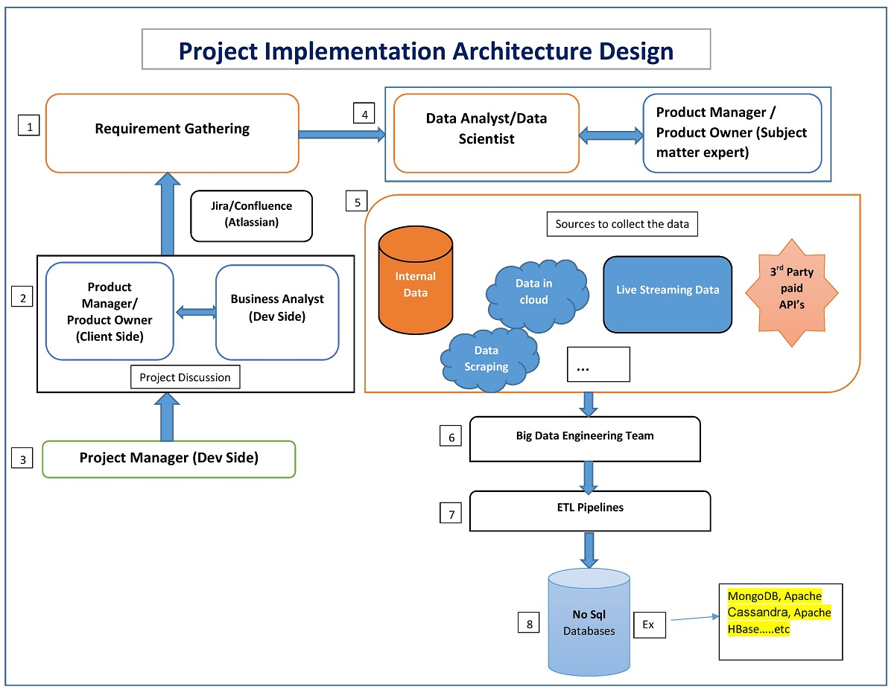

# Task2

## Setting Up An Open Source Project

### Baby Steps To Learn Data Science From None To Master

How the project is started in the industry and the team contribution to start new project?

Below is the Implementation Architecture to start with

1. Project Implementation Architecture

Basic things to know--------

2. Git and GitHub - It is an Internet hosting service for software development and version control using Git. It provides the distributed version control of Git plus access control, bug tracking, software feature requests, task management, continuous integration for every project.

3. Dockers - In simple terms, Docker is a software platform that simplifies the process of building, running, managing and distributing applications. It does this by virtualizing the operating system of the computer on which it is installed and running.

"Docker is an open platform for developing, shipping, and running applications."

## Who can contribute on this project?

## Anyone who wants to add their experience related to the field or a learner who has a understanding related to the topics can contribute.

## You are open to contribute your experience related to data science learnings and best practises, which can be the edge and help to compete in the growing competition.
